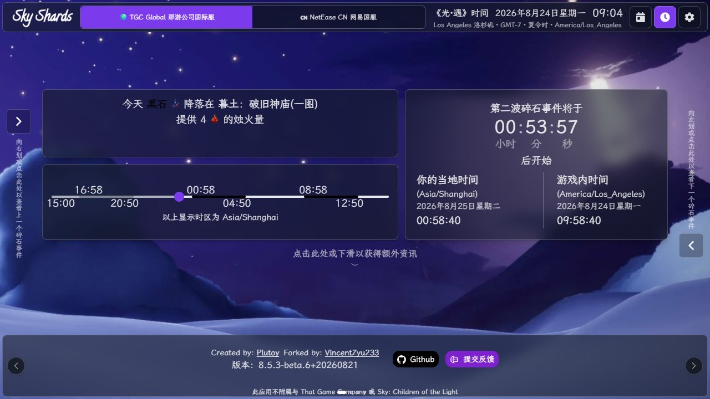
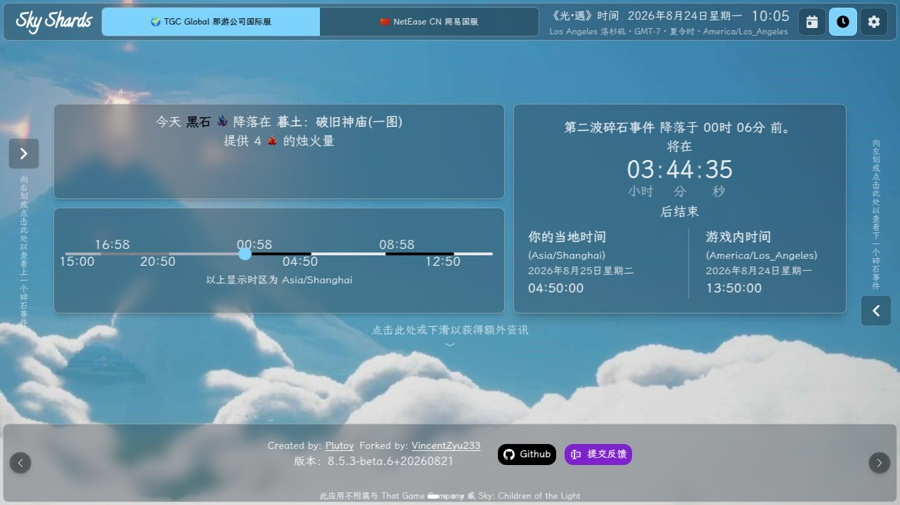
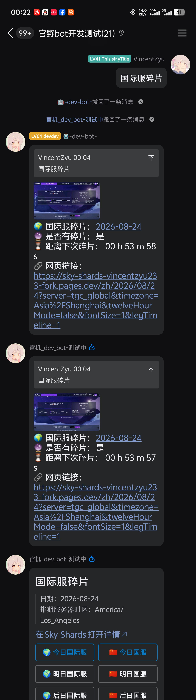

# 🔮 koishi-plugin-sky-shards

[](https://www.npmjs.com/package/koishi-plugin-sky-shards)
[](https://www.npmjs.com/package/koishi-plugin-sky-shards)

[](https://github.com/VincentZyuApps/koishi-plugin-sky-shards)
[](https://gitee.com/vincent-zyu/koishi-plugin-sky-shards)

[](https://forum.koishi.xyz/t/topic/xxxxx)
[](https://qm.qq.com/q/ZHj33L5cuC)

查询《光·遇》国服与国际服碎片，并将 [Sky Shards](https://github.com/VincentZyu233/sky-shards) [](https://github.com/VincentZyu233/sky-shards/blob/production/README.zh-cn.md) 的首屏摘要渲染为图片。

<h2>💬 交流反馈</h2>
<p>🐛 Bug 反馈 / 💡 建议 / 👨‍💻 插件开发交流，欢迎加群：</p>
<p><del>💬 插件使用问题 / 🐛 Bug反馈 / 👨‍💻 插件开发交流，欢迎加入QQ群：<b>259248174</b> 🎉（这个群G了）</del></p>
<p>💬 插件使用问题 / 🐛 Bug反馈 / 👨‍💻 插件开发交流，欢迎加入QQ群：<b>1085190201</b> 🎉</p>
<p>💡 在群里直接艾特我，回复的更快哦~ ✨</p>

## 🚀 快速开始

- 安装并启用提供 `puppeteer` 服务的插件，例如 `koishi-plugin-puppeteer` 或 `@shangxueink/koishi-plugin-puppeteer-without-canvas`。
- `url` 默认指向 Cloudflare Pages；也可替换为 GitHub Pages，或填写本地 / 公网 `pnpm dev` 启动的 Vite HTTP 地址，例如 `http://127.0.0.1:5173/`。
- 大陆网络环境访问 Sky Shards 不稳定时，截图代理请选择以下一种方式：
  - 使用 `isolate`：将本插件放入已启用的同一 `isolate` 分组，在分组中配置 `proxyAgent`，并将 `browserProxyMode` 设为 `inherit`。
  - 使用插件配置：将 `browserProxyMode` 设为 `configured`，并在 `browserProxyUrl` 填入代理地址。

## 📖 使用方法

```bash
国服碎片
国际服碎片 +1
国服碎片 20260824
国服碎片 +1 --light-mode true
国际服碎片 --lightMode false
```

**🖼️ Puppeteer 网页截图预览**

🌙 深色模式



☀️ 浅色模式



**💬 OneBot QQ 查询结果预览**



日期参数留空时查询对应服务器时区的今天。它只接受严格的 `yyyymmdd`、`+N` 与 `-N`；偏移按对应服务器的自然日计算。

`--light-mode` 与 `--lightMode` 可临时覆写页面主题，只接受 Sky Shards 上游值：`true` 为浅色、`false` 为深色、`system` 为跟随 Chromium 系统配色。

QQ 官方 Bot 会在截图与直达链接后，额外发送 Markdown 摘要和三行快捷按钮：左列为国际服的今日、明日、后日，右列为国服的对应日期。

## 🌐 代理与 isolate

`browserProxyMode` 是三态单选，默认 `disabled`（不使用代理）。选择 `inherit` 时会读取当前 Koishi 上下文的 `http.proxyAgent`，可与 `koishi-plugin-isolate` 一起使用；选择 `configured` 时仅使用 `browserProxyUrl`，默认地址为 `http://127.0.0.1:7890`，不会继承 isolate/http 代理。

将本插件和已禁用的同组插件放到启用的 `isolate` 分组内，并在该分组设置代理即可：

```yaml
group:proxy:
  isolate:example:
    proxyAgent: socks5://127.0.0.1:7890
  ~sky-shards:example: {}
```

截图时会为本次请求创建独立 Chromium BrowserContext，完成后立即关闭，不会改变其他 Puppeteer 插件的网络出口。

## ⚙️ 配置项

### 💬 消息发送配置

| 配置项 | 类型 | 默认值 | 说明 |
|---|---|---|---|
| `enableQuote` | `boolean` | `true` | bot 发送等待提示、截图结果和错误消息时，是否引用触发指令的消息 |
| `enableWaitingHint` | `boolean` | `true` | 是否显示“正在获取并生成碎片信息，请稍候”提示；任务结束后会自动尝试撤回 |

### 📌 指令配置

| 配置项 | 类型 | 默认值 | 说明 |
|---|---|---|---|
| `cnCommandName` | `string` | `"国服碎片"` | 国服碎片主指令名称 |
| `cnCommandAliases` | `string[]` | `[“今日国服碎片”, “国服今日碎片”, “光遇国服碎片”, “sky-cn-shards”]` | 国服碎片别名表格；空白、重复和与主指令同名的项会忽略 |
| `globalCommandName` | `string` | `"国际服碎片"` | 国际服碎片主指令名称 |
| `globalCommandAliases` | `string[]` | `[“今日国际服碎片”, “国际服今日碎片”, “光遇国际服碎片”, “sky-global-shards”]` | 国际服碎片别名表格；空白、重复和与主指令同名的项会忽略 |

### 🖼️ Sky Shards 页面与截图配置

| 配置项 | 类型 | 默认值 | 说明 |
|---|---|---|---|
| `url` | `string` | `"https://sky-shards-vincentzyu233-fork.pages.dev/"` | 默认使用 Cloudflare Pages [](https://sky-shards-vincentzyu233-fork.pages.dev/)；也可改为 GitHub Pages [](https://vincentzyu233.github.io/sky-shards/)，或填写通过 `pnpm dev` 部署到本地或公网的 Vite HTTP 服务器地址 |
| `displayTimeZone` | `string` | `"Asia/Shanghai"` | 截图中显示本地时间使用的 IANA 时区 |
| `lightMode` | `"true" \| "false" \| "system"` | `"system"` | Sky Shards 页面与截图主题；`true` 为浅色、`false` 为深色、`system` 跟随 Puppeteer Chromium 系统配色，与上游 URL 参数保持一致 |
| `enableGlobalShardOverrides` | `boolean` | `false` | 🧪 是否读取上游前端国际服临时覆写数据；国服不会读取覆写 |
| `enableShardProgressTimeline` | `boolean` | `true` | 是否显示 Sky Shards 的碎片时间轴和进度条；关闭后改为紧凑的三波时间摘要 |
| `screenshotDelayMs` | `number` | `666` | 截图前额外等待时间，单位毫秒；可用于等待网页动画和延迟加载内容完成 |
| `screenshotImageType` | `"png" \| "jpeg" \| "webp"` | `"png"` | Puppeteer 网页截图输出格式；PNG 无损但通常文件较大，JPEG 与 WebP 支持质量参数 |
| `screenshotQuality` | `number` | `80` | Puppeteer 截图质量，范围为 `0-100`；仅 `jpeg` 和 `webp` 生效 |

### 🛜 浏览器网络配置

| 配置项 | 类型 | 默认值 | 说明 |
|---|---|---|---|
| `browserProxyMode` | `"disabled" \| "inherit" \| "configured"` | `"disabled"` | 截图浏览器代理模式：`disabled` 不使用代理；`inherit` 继承当前 isolate/http 的 `proxyAgent`；`configured` 仅使用 `browserProxyUrl` |
| `browserProxyUrl` | `string` | `"http://127.0.0.1:7890"` | 配置项代理地址，仅 `browserProxyMode="configured"` 时生效 |

### 🤖 QQ 官方 Bot 配置

| 配置项 | 类型 | 默认值 | 说明 |
|---|---|---|---|
| `enableQQMarkdown` | `boolean` | `true` | QQ 官方 Bot 在截图后额外发送 Markdown 摘要和快捷按钮 |
| `qqMarkdownKeyboardJson` | `string` | 默认按钮 JSON | 自定义 QQ Markdown 按钮；支持 `${commandName}`、`${cnCommandName}`、`${globalCommandName}` 和 `${pageUrl}` 变量；JSON 无效时回退默认按钮 |
